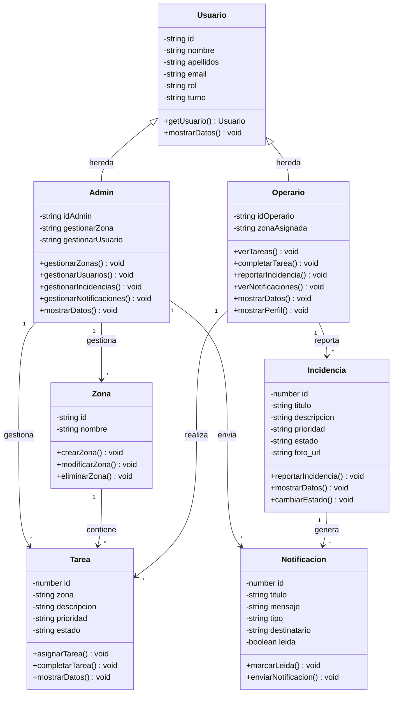

# DIAGRAMA DE CLASES - SANICLEAR

## Estructura de Clases



## Relaciones

```
HERENCIA:
  Usuario  <|--  Admin
  Usuario  <|--  Operario

ASOCIACIONES (1:*):
  Admin        --*  Zona         : gestiona
  Admin        --*  Notificacion : envia
  Admin        --*  Tarea        : gestiona
  Zona         --*  Tarea        : contiene
  Operario     --*  Tarea        : realiza
  Operario     --*  Incidencia   : reporta
  Incidencia   --*  Notificacion : genera
```
