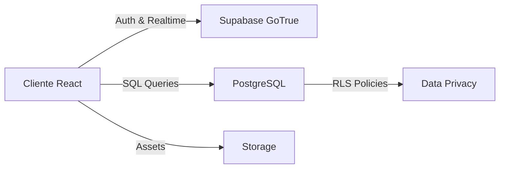

# 🏥 SANICLEARS — Sistema de Gestión de Higiene Hospitalaria
> **Proyecto Final de Ciclo (TFG)**  
> **Autor:** María Ceballos Mesías | **Curso:** 2025/26 | **Centro:** IES Albarregas  
> **Especialidad:** Desarrollo de Aplicaciones Web (DAW)

---

## 📑 Tabla de Contenidos

1. [🚀 Introducción](#1-introducción)
2. [🏗️ Arquitectura del Sistema](#2-arquitectura-del-sistema)
3. [⚙️ Documentación Técnica](#3-documentación-técnica)
4. [🌐 Despliegue y Hosting](#4-despliegue-y-hosting)
5. [📖 Manual de Operación](#5-manual-de-operación)
6. [🔑 Credenciales de Acceso](#6-credenciales-de-acceso)
7. [📈 Evolución y Futuro](#7-evolución-y-futuro)
8. [📚 Recursos y Bibliografía](#8-recursos-y-bibliografía)

---

## 🚀 1. Introducción

### 1.1 El Proyecto
**SANICLEARS** es una solución tecnológica diseñada para modernizar la gestión de limpieza y desinfección en centros sanitarios. Nace de la necesidad de sustituir los procesos manuales por un ecosistema digital eficiente, transparente y auditable en tiempo real.

> [!TIP]
> La aplicación está diseñada bajo el concepto de **Mobile-First**, priorizando la usabilidad del operario que se desplaza por el hospital.

### 1.2 Justificación
La idea surge tras observar el funcionamiento del **Hospital de Mérida**, donde la falta de trazabilidad en los partes de papel generaba cuellos de botella en la supervisión de zonas críticas.

| Desafío | Solución SANICLEARS |
| :--- | :--- |
| **Opacidad** | Trazabilidad absoluta de cada acción (quién, qué, dónde, cuándo) |
| **Lentitud** | Notificaciones instantáneas y reporte de incidencias con foto |
| **Papel** | Eliminación total de registros físicos, centralizando todo en la nube |

---

## 🏗️ 2. Arquitectura del Sistema

SANICLEARS utiliza una arquitectura de vanguardia basada en **Micro-servicios BaaS** y una **Single Page Application (SPA)** reactiva.

### 2.1 Stack Tecnológico (Frontend)
   

```env
VITE_SUPABASE_URL=https://zwmfzqdamdibjermgnyo.supabase.co
VITE_SUPABASE_ANON_KEY=eyJhbGciOiJIUzI1NiIsInR5cCI6IkpXVCJ9...
VITE_GEMINI_API_KEY=AIzaSy... (Tu clave de Google AI Studio)
```

*   **Core:** React 19 con lógica desacoplada.
*   **IA:** Gemini API (Google Generative AI) con inyección de contexto.
*   **Estilos:** Tailwind CSS v4 (Glassmorphism & Dark Mode).
*   **Estado:** Zustand (Gestión ligera de sesión y notificaciones).
*   **Animaciones:** GSAP (Interacciones premium y transiciones).

### 2.2 Infraestructura (Backend)
Se ha optado por **Supabase** como núcleo del backend, proporcionando una base de datos **PostgreSQL** robusta con seguridad a nivel de fila (RLS).



---

## ⚙️ 3. Documentación Técnica

### 3.1 Base de Datos (Modelado)
El sistema es **Multi-Tenant**, lo que permite que múltiples hospitales compartan la infraestructura manteniendo sus datos aislados por `entidad_id`.

#### 📌 Tablas Principales
*   `entidades`: Gestión de hospitales y planes de suscripción.
*   `usuarios`: Perfiles con roles (`superadmin`, `admin`, `operario`).
*   `zonas`: Áreas clasificadas por riesgo biológico.
*   `tareas`: Registro de limpieza con estados dinámicos.
*   `incidencias`: Control de fallos con soporte fotográfico.

### 3.2 Seguridad y RLS
> [!IMPORTANT]
> Se han implementado **Políticas de Seguridad (RLS)** que garantizan que un operario de un hospital NUNCA pueda ver datos de otro hospital, ni siquiera a través de la consola del navegador.

### 3.3 Implementación de IA (SaniclearBot)
El asistente utiliza el SDK de **Google Generative AI** para conectar con modelos de lenguaje de gran tamaño (LLM).

*   **Grounding**: Toda la documentación técnica se inyecta como contexto inicial en cada conversación, asegurando que el bot no "alucine" y responda basado estrictamente en el manual del proyecto.
*   **Interfaz**: El chat utiliza `react-markdown` para renderizar respuestas con formato profesional en tiempo real.
*   **Modelo**: Configurado para usar `Gemini 1.5 Flash` (o versiones superiores) para una respuesta rápida y precisa.

---

## 🌐 4. Despliegue y Hosting

La infraestructura es 100% Cloud, garantizando escalabilidad y coste cero para la fase de demo.

*   **Frontend:** Alojado en **Vercel** con CI/CD (despliegue automático desde GitHub).
*   **Dominio:** Gestionado por **Cloudflare** para protección contra ataques y gestión de DNS.
*   **Configuración:**
   - `VITE_SUPABASE_URL`
   - `VITE_SUPABASE_ANON_KEY`
   - `VITE_GEMINI_API_KEY`
*   **SSL:** Encriptación de extremo a extremo certificada.

---

## 📖 5. Manual de Operación

### 5.1 Roles y Permisos

| Rol | Función Principal | Herramientas Clave |
| :--- | :--- | :--- |
| **Superadmin** | Control de negocio | Gestión de hospitales y métricas globales |
| **Admin** | Gestión local | Control de zonas, plantilla y asignación de tareas |
| **Operario** | Ejecución | Lista de tareas, reporte de fallos y notificaciones |

### 5.2 SaniclearBot (Asistente de IA)
El sistema incluye un asistente inteligente integrado que ayuda a resolver dudas sobre el proyecto y la operativa del hospital.

*   **¿Cómo usarlo?**: Pulsa el icono del robot en la esquina inferior derecha.
*   **Capacidades**:
    *   Explicar el uso de cualquier módulo.
    *   Proporcionar credenciales de prueba.
    *   Resumir normativas de limpieza según el manual.
    *   Ayudar al tribunal a entender la arquitectura técnica.

### 5.3 Flujo de Trabajo Típico
1.  **Administrador** crea una zona (ej. *Quirófano 1*) y asigna una tarea recurrente.
2.  **Operario** recibe la tarea en su móvil y la marca como "En Curso".
3.  Si hay un problema (ej. *Falta desinfectante*), el **Operario** crea una incidencia con foto.
4.  El **Administrador** recibe el aviso y gestiona la resolución.
5.  **Operario** finaliza la tarea y el sistema registra el tiempo empleado.

---

## 🔑 6. Credenciales de Acceso (Demo)

> [!CAUTION]
> Estas credenciales son para uso exclusivo de la defensa del TFG.

| Perfil | Usuario | Contraseña |
| :--- | :--- | :--- |
| **Superadmin** | `superadmin@saniclear.com` | `SuperAdmin1234!` |
| **Admin** | `admin@saniclears.com` | `Admin1234!` |
| **Operario** | `juan.perez@saniclears.com` | `Operario123!` |

---

## 📈 7. Evolución y Futuro

El proyecto está preparado para escalar con las siguientes funcionalidades planificadas:
*   **QR Check-in**: Escaneo físico de códigos en las puertas para validar la presencia.
*   **IA de Predicción**: Análisis de carga de trabajo basado en la ocupación hospitalaria.
*   **Mapas 3D**: Visualización del estado del hospital en un plano interactivo.

---

## 📚 8. Recursos y Bibliografía
*   **React Documentation**: [react.dev](https://react.dev)
*   **Supabase Security**: [supabase.com/docs](https://supabase.com/docs)
*   **PostgreSQL RLS Patterns**: Referencia para el aislamiento de datos multi-inquilino.

---
*© 2026 SANICLEARS — Innovación en Higiene Hospitalaria*
